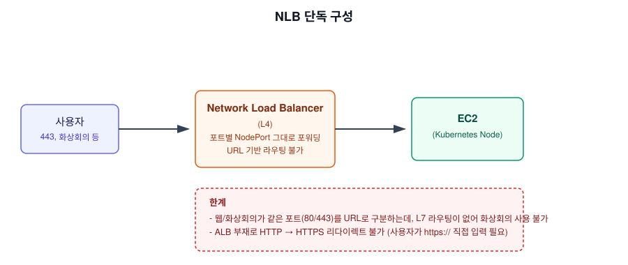
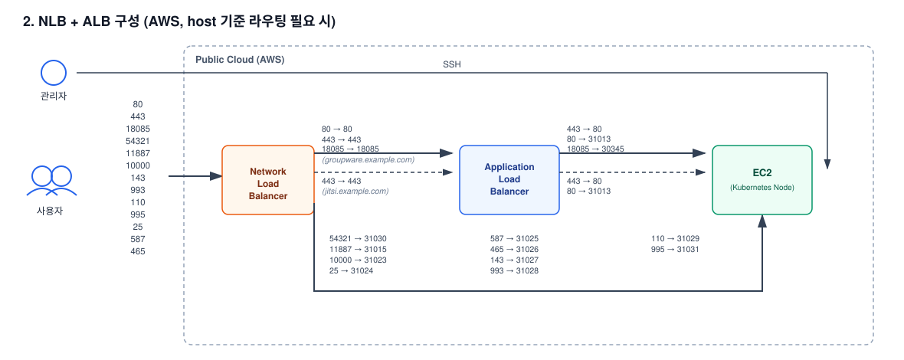

# 온프레미스 솔루션의 퍼블릭 클라우드(AWS) 아키텍처 설계

TA Unit

## 1. 배경

### 가. 요구사항

1) 온프레미스(Kubernetes 자체 구축)로만 제공되던 솔루션을, 퍼블릭 클라우드(AWS) 환경에서도
   구축할 수 있도록 로드밸런서·서버·방화벽 요구사항과 아키텍처를 정리해야 했음
2) AWS에서는 별도의 L4/L7 로드밸런서(NLB/ALB)를 조합해 온프레미스의 L7 스위치 역할을
   대체해야 하므로, 어떤 조합으로 구성해야 기존 서비스(웹/화상회의/알림 등)를 동일하게
   제공할 수 있는지 검증이 필요했음

## 2. 기대효과

### 가. 기존 자산 재사용을 통한 설계 효율화

1) NLB 단독 구성의 한계(L7 부재)를, 신규 컴포넌트를 새로 설계하지 않고 이미 온프레미스용으로
   검증해둔 인바운드 프록시 구성 중 일부만 발췌해 해결 — 설계 리소스 절감 및 검증된 구성
   요소 재사용

### 나. 실제 구축 가능한 수준의 아키텍처 확보

1) Client IP 보존, SSL 종단 분리, AWS 클라우드 특유의 네트워킹 요건(Source/Destination
   Check)까지 포함해, 문서만이 아니라 실제 구축까지 이어질 수 있는 아키텍처로 설계

### 다. AS-IS / TO-BE 비교

| 항목 | AS-IS (NLB 단독) | TO-BE (NLB + ALB) |
|---|---|---|
| 로드밸런서 구성 | NLB 단독 (L4만) | NLB + ALB 조합 (L4 + L7) |
| 화상회의 서비스 | URL 기반 라우팅 불가로 사용 불가 | ALB의 host 기준 라우팅으로 웹/화상회의 분기 지원 |
| HTTP → HTTPS 리다이렉트 | 불가 (사용자가 https:// 직접 입력 필요) | ALB가 자동 리다이렉트 처리 |
| SSL 처리 | NLB에서만 처리 | ALB(Pass-through 대상 포트) / NLB로 종단 분리 |
| Client IP 보존 | NLB Proxy Protocol만 | NLB Proxy Protocol + ALB X-Forwarded-For |

## 3. 구성도

### 가. NLB 단독 구성 (한계)

### 나. NLB + ALB 구성 (해결)

## 4. 성과

1) 온프레미스 전용으로만 존재하던 솔루션 아키텍처를, 퍼블릭 클라우드(AWS)에서도 동일한
   서비스 범위(웹+화상회의+알림 등)로 구축 가능한 형태로 설계 완료
2) NLB 단독 구성의 기능적 한계(화상회의 미지원, HTTPS 리다이렉트 불가)를, 기존에 다른
   목적으로 설계해둔 온프레미스 인바운드 프록시 구성 일부를 재사용해 해결
3) 클라이언트 IP 보존, SSL 종단 분리, CNI 네트워킹 요건까지 포함한 실제 구축 가능한 수준의
   아키텍처 문서로 정리

---

## 상세 문서

방화벽 세부 정책(포트/도메인 단위), 서버 디스크/볼륨 구성 기준 등을 포함한 상세 문서는
비공개 리포지토리에 별도 보관 중입니다. 필요 시 요청해주시면 공유드리겠습니다.
