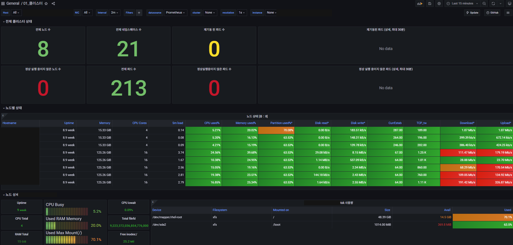
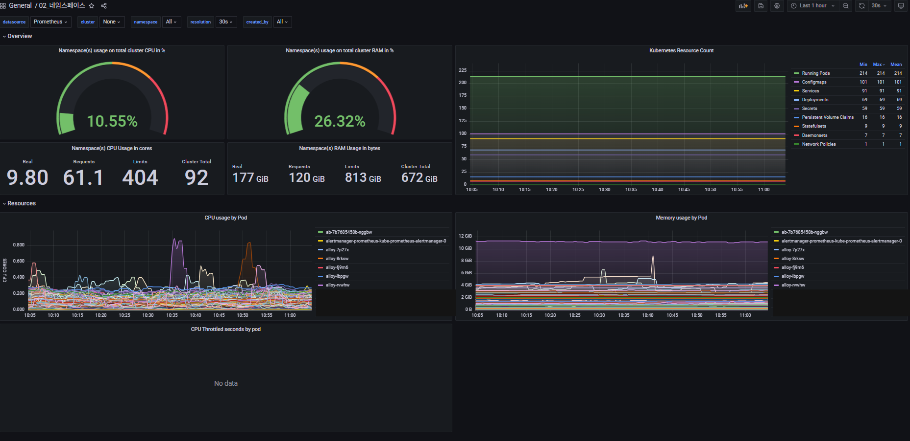
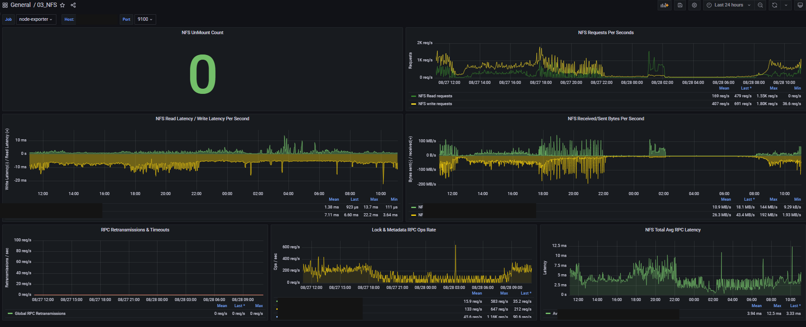

# Prometheus Stack + Grafana 커스텀 모니터링 대시보드 구축

## 1. 배경

### 가. 목적

1) 고객사 모니터링 대시보드 제공을 통한 이슈 추적 및 장애 사전 대응

### 나. 기존 구조의 한계

1) 서버 모니터링은 별도 솔루션으로 가능했으나, K8s 클러스터 전용 모니터링은 진행되지 않고 있었음
2) 기존 서버 모니터링 솔루션은 별도 모니터링 서버와의 통신이 전제 조건이라, 통신이 불가한
   폐쇄망 환경에서는 설치 자체가 불가능한 구조적 제약이 있었음
3) Prometheus Stack + Grafana는 이미 기본 설치되고 있었지만, 딸려오는 기본 대시보드만
   사용 중이었고 메트릭 정보와 클러스터 노드 상태를 한눈에 보는 뷰가 부족했음

## 2. 기대효과

### 가. 통신 제약 해소

1) 별도 모니터링 서버 구축 없이, 기본 설치되는 Prometheus-Grafana를 활용해 K8s + 서버 통합
   대시보드를 제공 — 폐쇄망 환경에서도 동일하게 동작

### 나. 장애처리 시간 감소

1) K8s 클러스터에 대한 이슈 추적이 가능해지고, 장애 발생 시 시계열 메트릭을 바로 확인할 수 있음

### 다. 드릴다운 기반 운영 편의성

1) 클러스터 → 노드 → 네임스페이스 순으로 단계적으로 좁혀가며 원인을 추적할 수 있는 대시보드 체계 구성

### 라. 스토리지 계층 가시성 확보

1) 클러스터/노드 단위 리소스 모니터링만으로는 확인하기 어려웠던 NFS I/O·지연을 별도 대시보드로 보완

### 마. AS-IS / TO-BE 비교

| 항목 | AS-IS | TO-BE |
|---|---|---|
| K8s 클러스터 모니터링 | 미진행 (기본 대시보드만 사용) | 클러스터/노드/네임스페이스 3종 드릴다운 대시보드 |
| 스토리지(NFS) 모니터링 | 없음 | NFS I/O·지연 전용 대시보드 추가 |
| 서버 모니터링 방식 | 별도 솔루션, 별도 모니터링 서버와 통신 필요 | 기본 설치되는 Prometheus-Grafana로 통합, 별도 통신 불필요 |
| 폐쇄망 환경 대응 | 통신 불가 시 설치 자체 불가 | 통신 제약 없이 동일하게 동작 |
| 장애 대응 | 시계열 메트릭 확인 어려움 | 이슈 추적 가능, 장애처리 시간 감소 |
| 적용 범위 | 개별 대응 | 전체 배포 표준으로 반영 |

## 3. 모니터링 구성

```
Exporter ──(pull metrics)──▶ Prometheus Server ──▶ Storage
                                    ▲
                                    │ Rule define/Manage
                              Prometheus Operator

Prometheus Server ◀──(PromQL)── Grafana ──▶ Administrator
```

### 드릴다운 구조

```
클러스터 대시보드 (전체 현황 요약)
        │  패널 클릭 (nodegroup)
        ▼
노드 대시보드 (노드그룹별 상태/파드/컨테이너)
        │  패널 클릭 (namespace)
        ▼
네임스페이스 대시보드 (파드/컨테이너 리소스 상세)
```

## 4. 성과

1) 별도 모니터링 서버·통신 없이 기존 Prometheus-Grafana만으로 K8s+서버 통합 모니터링 체계를
   확보해, 폐쇄망 환경 제약을 해소
2) 24시간 관제 인원이 클러스터/노드/네임스페이스 단위로 상태를 한눈에 파악하고 드릴다운으로
   세부 원인까지 추적할 수 있게 됨, NFS 대시보드로 스토리지 계층 I/O·지연 확인까지 커버
3) 전체 배포 표준으로 반영되어 신규 구축 환경에 기본 포함

## 5. 대시보드 스크린샷

(스크린샷 내 IP, 호스트명, 제품/브랜드명 등 식별정보는 마스킹 처리됨)







<!--  -->

---

## 상세 문서

PromQL 쿼리 작성 세부 사례, 패널별 상세 설계는 비공개 리포지토리에 별도 보관 중입니다.
필요 시 요청해주시면 공유드리겠습니다.
